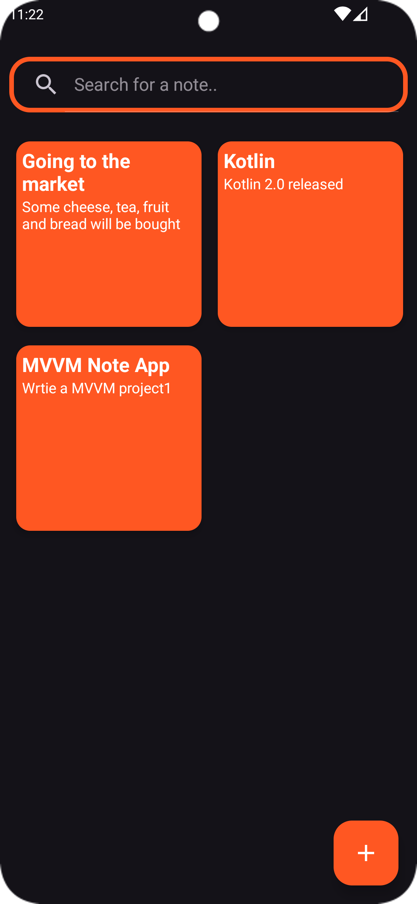

<h1 align="center" id="title">MVVM Note App</h1>

This project is a note-taking application developed using Kotlin and the MVVM architecture. It includes the following features:

<ul>
  <li>Add notes</li>
  <li>Edit notes</li>
  <li>Delete notes</li>
  <li>Search notes</li>
</ul>

<h2>Screenshots</h2>

 
  
  
  
  
  
  
  

<h2>Technologies Used</h2>

The project utilizes several modern technologies and libraries to provide a robust and efficient solution. Here are the key technologies used:

<ul>
  <li><strong>Kotlin</strong>: The primary programming language used for the application.</li>
  <li><strong>MVVM Architecture</strong>: A design pattern that separates the application's logic, UI, and data handling.</li>
  <li><strong>Room Database</strong>: A SQLite object mapping library that provides an abstraction layer over SQLite to allow for more robust database access while harnessing the full power of SQLite.</li>
  <li><strong>Hilt</strong>: A dependency injection library to manage dependencies.</li>
  <li><strong>Android Jetpack Components</strong>: Various libraries that help in developing robust and maintainable apps.
    <ul>
      <li><strong>Navigation Component</strong>: For handling navigation and passing data between fragments.</li>
      <li><strong>LiveData</strong> and <strong>ViewModel</strong>: For managing UI-related data in a lifecycle-conscious way.</li>
      <li><strong>ViewBinding</strong>: For easier and safer binding of UI components.</li>
    </ul>
  </li>
  <li><strong>Kotlin Coroutines</strong>: For managing background threads, simplifying code, and reducing the need for callbacks.</li>
  <li><strong>RecyclerView</strong>: For displaying lists of data.</li>
  <li><strong>Material Components</strong>: For implementing Material Design UI components.</li>
</ul>

<h2>Build Configuration</h2>

Here is the build configuration for the project:

<pre>
<code>
//build.gradle(:app)
plugins {
    id("com.android.application")
    id("org.jetbrains.kotlin.android")
    id("kotlin-kapt")
    id("com.google.dagger.hilt.android")
    id("androidx.navigation.safeargs.kotlin")
    id("kotlin-parcelize")
}
dependencies {

    implementation(libs.androidx.core.ktx)
    implementation(libs.androidx.appcompat)
    implementation(libs.material)
    implementation(libs.androidx.activity)
    implementation(libs.androidx.constraintlayout)
    implementation(libs.androidx.recyclerview)
    implementation(libs.androidx.navigation.fragment.ktx)
    implementation(libs.androidx.navigation.ui.ktx)
    testImplementation(libs.junit)
    androidTestImplementation(libs.androidx.junit)
    androidTestImplementation(libs.androidx.espresso.core)
    // Hilt
    implementation("com.google.dagger:hilt-android:2.51.1")
    kapt("com.google.dagger:hilt-android-compiler:2.51.1")
    
    // Room
    implementation("androidx.room:room-runtime:2.6.1")
    kapt("androidx.room:room-compiler:2.6.1")
    implementation("androidx.room:room-ktx:2.6.1")

    // Lifecycle components
    implementation("androidx.lifecycle:lifecycle-livedata-ktx:2.8.1")
    implementation("androidx.lifecycle:lifecycle-viewmodel-ktx:2.8.1")

    // Coroutine
    implementation("org.jetbrains.kotlinx:kotlinx-coroutines-core:1.8.0")
    implementation("org.jetbrains.kotlinx:kotlinx-coroutines-android:1.8.0")
    
    //SwipeDecorator
    implementation("it.xabaras.android:recyclerview-swipedecorator:1.4")
}

buildscript {
    repositories {
        google()
    }
    dependencies {
        val nav_version = "2.7.7"
        classpath("androidx.navigation:navigation-safe-args-gradle-plugin:$nav_version")
        classpath("org.jetbrains.kotlin:kotlin-gradle-plugin:1.9.0")
        classpath("com.android.tools.build:gradle:8.1.4")
    }
}

//build.gradle
plugins {
    alias(libs.plugins.android.application) apply false
    alias(libs.plugins.jetbrains.kotlin.android) apply false
    id("com.google.dagger.hilt.android") version "2.51.1" apply false
    
}

       
